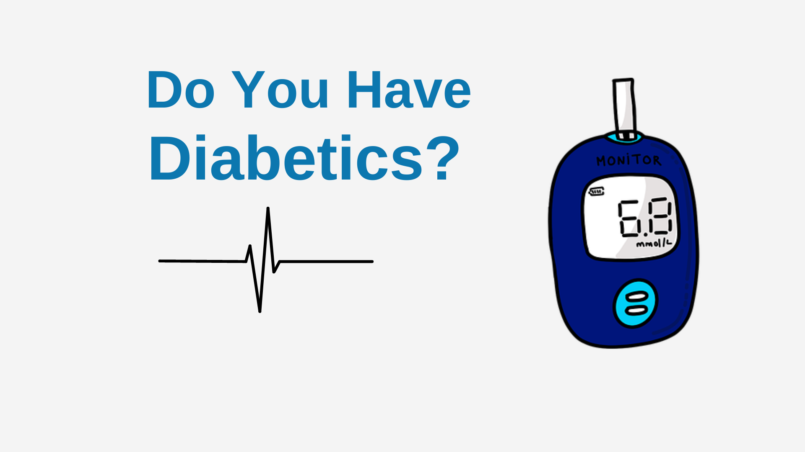

# Health Care Insurance Tracker | Treasure Hack 3.0
---

|Team Member |Discord|
|----|--|
|Giri Prasath D|GIRIPRASATH.D#2649|
|Aman Yadav|Automatlog#4422|
|Ani Utkin|Ani#3740|

--

# Problem Statement

## About the Project

## Inspiration

The inspiration for this project came from the increasing costs of healthcare and the need for individuals to have better control over their health expenses. We wanted to create a tool that would help individuals understand their insurance coverage and make more informed decisions about their healthcare.

## What it does
Our app, the Health Care Insurance Tracker, allows users to input their health information and receive personalized recommendations for maintaining and improving their health. The app also predicts the insurance claim amount based on the user's number of dependents, smoker status, blood pressure, and diabetes status.

## How we built it
We built the Health Care Insurance Tracker using Python and the sklearn library for machine learning. We used a Random Forest Regressor model to make predictions about insurance claims. Additionally, we used the Streamlit library to create a user-friendly interface for the app.

## Challenges we ran into
One of the main challenges we faced was cleaning and preprocessing the data. We had to handle missing values and outliers in order to train our model effectively. Another challenge was creating a user-friendly interface that would be easy for individuals to navigate.

## Accomplishments that we're proud of
We are proud of being able to create a functional app that can help individuals make more informed decisions about their healthcare. We are also proud of the accuracy of our predictions, which can help individuals better understand their insurance coverage.

## What we learned
Through this project, we learned about the importance of data preprocessing and cleaning when building machine learning models. We also learned about the different libraries and tools available for creating user-friendly interfaces.

##  What's next for Health Care Insurance Tracker
In the future, we hope to add more features to the app such as the ability for users to input their insurance policy details and receive more specific recommendations. We also plan to improve the accuracy of our predictions by incorporating more data and using more advanced machine-learning techniques.

Presentation link : [Click Here](https://github.com/giriprasathd/data/blob/main/Health%20Care%20Insurance%20Tracker.pdf)

Demo video link  : [Click Here](https://www.youtube.com/watch?v=uYgmywdBuc8)

Images: 

